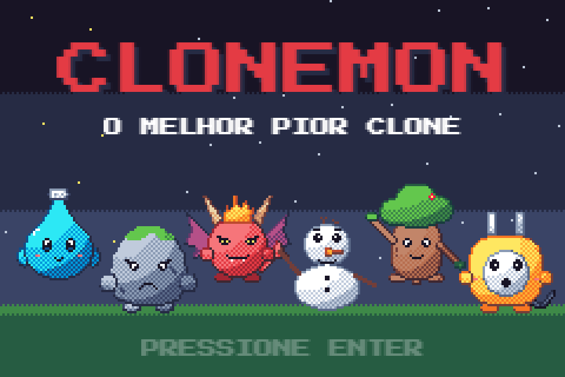
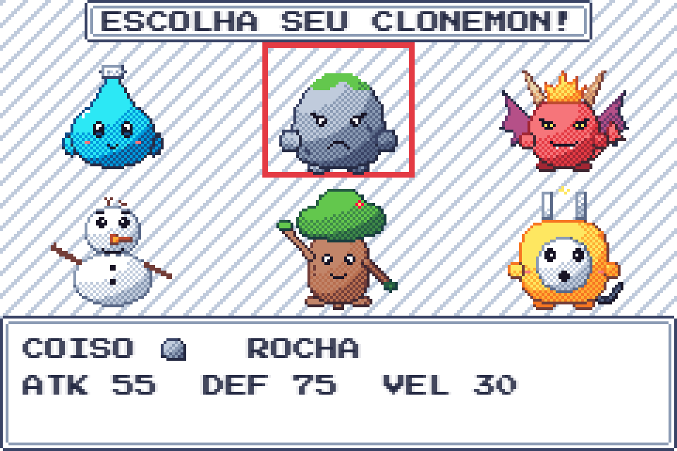
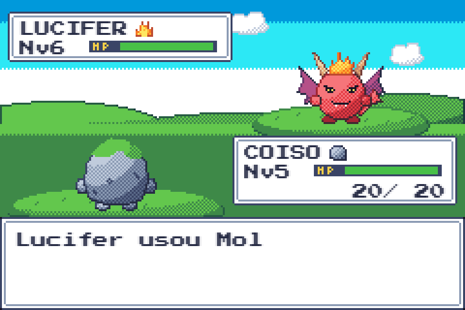
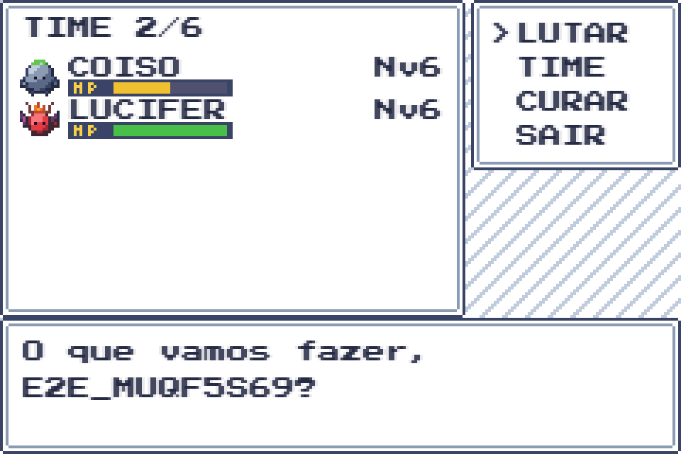

# CLONEMON

> O melhor pior clone de Pokémon que você já viu, agora em pixel art.

Batalhas por turno contra clonemons selvagens, time de até 6, XP e níveis, progresso salvo no servidor.
Reescrita completa do [projeto de POO original](https://github.com/zHobbit/CLONEMON_PROJETO_N1_POO):
Spring Boot + PostgreSQL no backend e Phaser no navegador.

| | |
|---|---|
|  |  |
|  |  |

## Os clonemons

Os 6 originais são as opções de inicial:

| Clonemon | Tipo | Golpes iniciais | Nível 7 | Nível 12 |
|---|---|---|---|---|
| Lindoya | ÁGUA | Cuspe, Vap de alta pressão | Piso molhado | Água de salsicha |
| Coiso | ROCHA | Pedrada, Meteoro | Casca grossa | Pedra no sapato |
| Lucifer | FOGO | Molotov, Fogo na Babilônia | Churrasco grego | Sangue nos olhos |
| Olaf | GELO | Cubo de gelo, Fica frio aí | Frio na barriga | Picolé de chuchu |
| Groot | GRAMA | Corte de papel A4, Cartolinada | Urtigada | Chá de camomila |
| EletroPaulo | RAIO | Volt, Bivolt | Conta de luz | Dedo na tomada |

E estes 6 só aparecem na natureza (vença para recrutar):

| Clonemon | Tipo | O que é | Golpes iniciais | Nível 7 | Nível 12 |
|---|---|---|---|---|---|
| Boto | ÁGUA | O boto cor-de-rosa da lenda, de chapéu branco | Esguicho, Pororoca | Papo de boto | Rodamoinho |
| PaoDeAcucar | ROCHA | O morro do Rio como pão doce, com confeitos e bondinho | Pedra portuguesa, Bondinho | Cobertura extra | Morro abaixo |
| Pimentinha | FOGO | Pimenta dedo-de-moça levada, com o rabo pegando fogo | Ardidinha, Pimenta nos olhos | Molho de pimenta | Malagueta |
| Pinguim | GELO | O pinguim de louça de cima da geladeira | Ímã de geladeira, Fecha a geladeira | Escorregão | Congelador |
| Abacaxi | GRAMA | Abacaxi casca grossa, de poucos amigos | Coroada, Descascar o abacaxi | Folha da coroa | Sono pós-almoço |
| Gatonet | RAIO | Um "gato" de luz em forma de gato, com rabo de fio | Gambiarra, Apagão | Fio desencapado | Sete vidas |

Todos aprendem 2 golpes novos ao subir de nível, alguns com efeitos de status (queimar, congelar, paralisar, dormir) ou que mudam atributos.

Os tipos funcionam em ciclo: cada um causa o dobro de dano no seguinte e metade no anterior.

```
ÁGUA → ROCHA → FOGO → GELO → GRAMA → RAIO → ÁGUA
```

## Como jogar

1. Crie um treinador e escolha seu primeiro clonemon. Você começa na Vila Capim, na porta de casa.
2. Ande pelo mapa com as setas. No capim alto da Rota 1 aparecem clonemons selvagens de nível parecido com o do seu time.
3. Vencer dá XP e o clonemon derrotado entra para o seu time (ou vai para o PC, se o time estiver cheio).
4. Os treinadores CAIO, BIA e ZECA vigiam a rota: quem cruza a linha de visão deles é desafiado (e não dá para fugir).
5. No **Centro Clonemon** (o prédio de telhado vermelho) o time recupera HP e PP. Enter lê placas e conversa.
6. Enter sem nada à frente, ou Esc, abre o menu: em **TIME** você organiza a ordem e troca monstros entre o time e o PC.

O progresso é salvo a cada turno: dá para fechar o navegador no meio de uma batalha e continuar depois.

**Controles:** setas navegam, Enter / Espaço / Z confirmam, Esc / Backspace / X voltam, M liga e desliga o som. O mouse também funciona.

## Rodando localmente

**Só quer jogar (Windows)?** Com o Docker Desktop aberto, dê dois cliques em [`jogar.cmd`](jogar.cmd).
Ele sobe tudo e abre o jogo em http://localhost:8081. A primeira vez demora alguns minutos.

> Abrir o `index.html` direto do disco não funciona: o navegador bloqueia o jogo fora de um servidor.

Para desenvolver: Java 21+, Node 22+ e Docker.

### Jeito rápido (banco temporário)

O backend sobe um Postgres descartável sozinho, via Testcontainers. Os dados somem quando ele para.

```bash
cd backend && ./mvnw spring-boot:test-run -Dspring-boot.run.main-class=br.clonemon.TestClonemonApplication
```

```bash
cd frontend && npm install && npm run dev
```

Abra http://localhost:5173.

### Com banco persistente

```bash
docker compose up -d
```

```bash
cd backend && ./mvnw spring-boot:run
```

Depois, o frontend como acima.

| Serviço | Porta | Variável |
|---|---|---|
| Frontend (Vite) | 5173 | — |
| API | 8081 | `PORT` |
| PostgreSQL (compose) | 5433 | `DB_URL`, `DB_USER`, `DB_PASSWORD` |

Em produção, defina `JWT_SECRET` (pelo menos 32 bytes).

### Igual à produção (Docker)

A mesma imagem do deploy, com jogo e API juntos em http://localhost:8081:

```bash
docker compose --profile app up -d --build
```

Para publicar na internet, veja [docs/deploy.md](docs/deploy.md).

## Testes

```bash
cd backend && ./mvnw verify
```

```bash
cd frontend && npm run typecheck && npm test
```

```bash
cd frontend && npm run test:e2e
```

- `verify` roda os testes de domínio, de casos de uso, de persistência e da API (precisa do Docker) e gera a cobertura em `backend/target/site/jacoco/index.html`.
- `test:e2e` joga uma partida inteira no navegador e sobe o backend sozinho (precisa do Docker). No Windows usa o Edge instalado.
- `npm run art:preview` salva um print de toda a pixel art em `frontend/test-results/screens/art-gallery.png`.

## Documentação

- [Arquitetura, API e testes](docs/architecture.md)
- [Banco de dados e diagrama ER](docs/database.md)
- [Deploy (Render + Neon)](docs/deploy.md)

## Stack

| Parte | Tecnologias |
|---|---|
| Backend | Java 21, Spring Boot 4 (Web MVC, Data JPA, Security com JWT), Flyway, PostgreSQL |
| Frontend | TypeScript, Vite, Phaser 4, fonte Press Start 2P |
| Arte | Pixel art gerada em código, paleta ENDESGA 32 |
| Testes | JUnit 5, AssertJ, Testcontainers, MockMvc, Vitest, Playwright |

## Créditos

Projeto original de POO (UAM, Ciência da Computação), sob orientação do Prof. André Santana:

- Victor Holanda de Oliveira
- Lucas Sousa Ferreira dos Santos
- Gabriel Alves Memoli

A versão original, de console, continua em [`legacy/`](legacy/) para comparação.
