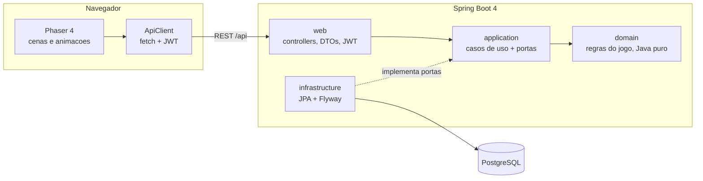

# Arquitetura

## Backend (`backend/`)

Arquitetura hexagonal leve. As dependências apontam para dentro: `web → application → domain`.
A camada `infrastructure` implementa as portas definidas em `application`.

| Pacote | Responsabilidade |
|---|---|
| `domain` | Regras puras, sem Spring: `Element` (ciclo de tipos), `Monster`, `DamageCalculator`, `ExperienceCurve`, `AiStrategy` e a máquina de estados `Battle`. |
| `application` | Casos de uso (`AuthService`, `TeamService`, `BattleService`) e as portas (`TrainerRepository`, `MonsterRepository`, `BattleRepository`, `SpeciesCatalog`). |
| `infrastructure.persistence` | Entidades JPA e adapters das portas. Os repositórios Spring Data ficam aninhados dentro dos adapters. |
| `web` | Controllers REST, DTOs (records), erros como ProblemDetail (RFC 9457), segurança JWT. |

### Ciclo de elementos

`AGUA → ROCHA → FOGO → GELO → GRAMA → RAIO → AGUA`: cada tipo causa 2x de dano no seguinte e 0,5x no anterior.

### Eventos de turno

Um turno devolve uma lista de `Battle.Event`. Cada evento tem o texto, um efeito visual (`ENEMY_HIT`, `PLAYER_FAINT`, `PLAYER_SWITCH`…)
e o HP dos dois monstros ativos logo depois dele. O frontend anima o turno passo a passo comparando esses estados,
sem precisar interpretar o texto.

## API

| Método | Rota | Descrição |
|---|---|---|
| POST | `/api/auth/register` | Cria treinador e devolve o token |
| POST | `/api/auth/login` | Devolve o token |
| GET | `/api/species` | Catálogo de espécies (público) |
| GET | `/api/team` | Time e PC |
| PUT | `/api/team` | Define o time: `{ "monsterIds": [..] }` (1 a 6, na ordem) |
| POST | `/api/team/starter` | Escolhe o inicial: `{ "speciesId": 3 }` |
| POST | `/api/team/heal` | Centro Clonemon (fora de batalha) |
| POST | `/api/battles` | Inicia batalha contra um clonemon selvagem |
| GET | `/api/battles/active` | Batalha em andamento (404 se não houver) |
| GET | `/api/battles/{id}` | Estado de uma batalha |
| POST | `/api/battles/{id}/turns` | `{ "action": "MOVE", "moveIndex": 0 }`, `{ "action": "SWITCH", "teamIndex": 1 }` ou `{ "action": "RUN" }` |

Erros: 400 (entrada inválida), 401 (sem token ou credenciais erradas), 404, 409 (conflito de estado: batalha já em andamento, time desmaiado, turno concorrente).

## Frontend (`frontend/`)

Vite + TypeScript + Phaser 4, em 240x160 (resolução do GBA) com escala inteira.

| Pasta | Conteúdo |
|---|---|
| `src/api` | Tipos da API e `ApiClient` (token no localStorage; 401 leva ao login) |
| `src/battle` | `planTurn`: transforma eventos de turno em passos de animação (lógica pura, testada) |
| `src/scenes` | Boot, Título, Login (formulário HTML), Inicial, Menu, Time, Batalha |
| `src/ui` | Caixa de texto, menus, barra de HP, teclado |
| `src/art` | Pixel art feita em código (veja abaixo) |
| `src/audio` | Música e efeitos sonoros sintetizados com Web Audio (pulso, triângulo e ruído, como no Game Boy); tecla M liga e desliga |
| `src/fx` | Fades entre cenas, entrada de batalha e efeitos de golpe por elemento |

### Pixel art

Não há arquivos de imagem: toda a arte é gerada em código na inicialização, com a paleta
[ENDESGA 32](https://lospec.com/palette-list/endesga-32).

- `raster.ts`: um rasterizador pequeno. Formas (elipses, polígonos, linhas) recebem sombreamento com luz vinda de cima à esquerda, contorno seletivo e um pontilhado discreto.
- `monsters.ts`: cada clonemon é feito de formas sombreadas mais detalhes desenhados à mão em grades de texto (olhos, bocas, rachaduras). O segundo quadro da animação de espera move as formas.
- `icons.ts` e `scenery.ts`: ícones de tipo, fundo da batalha, céu do título, ladrilho dos menus.
- `textures.ts`: transforma tudo em texturas e animações do Phaser.

Para ver toda a arte ampliada, rode `npm run dev` e abra `http://localhost:5173/art.html`,
ou rode `npm run art:preview` para salvar um print em `test-results/screens/art-gallery.png`.

## Testes

| Camada | Ferramenta | O que cobre |
|---|---|---|
| Domínio | JUnit 5 + AssertJ | Ciclo de elementos, dano, XP, máquina de estados da batalha, IA |
| Casos de uso | JUnit com portas em memória | Autenticação, time, batalha, recrutamento, salvamento |
| Persistência | Testcontainers (Postgres real) | Seed, ida e volta das entidades, `jsonb`, restrições |
| API | MockMvc + Testcontainers | Autenticação, contratos, erros, batalha completa |
| Frontend | Vitest | Cliente da API, animação de turno, HP, navegação, time, arte |
| Ponta a ponta | Playwright | Criar treinador, escolher inicial, batalhar, recarregar e conferir o save |
