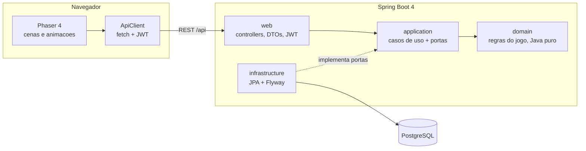

# Arquitetura

## Backend (`backend/`)

Arquitetura hexagonal leve. As dependências apontam para dentro: `web → application → domain`.
A camada `infrastructure` implementa as portas definidas em `application`.

| Pacote | Responsabilidade |
|---|---|
| `domain` | Regras puras, sem Spring: `Element` (ciclo de tipos), `Monster`, `DamageCalculator`, `ExperienceCurve`, `AiStrategy`, a máquina de estados `Battle`, `NpcTrainer` e `WorldPosition`. |
| `application` | Casos de uso (`AuthService`, `TeamService`, `BattleService`, `WorldService`) e as portas (`TrainerRepository`, `MonsterRepository`, `BattleRepository`, `SpeciesCatalog`, `NpcCatalog`, `WorldRepository`). |
| `infrastructure.persistence` | Entidades JPA e adapters das portas. Os repositórios Spring Data ficam aninhados dentro dos adapters. |
| `web` | Controllers REST, DTOs (records), erros como ProblemDetail (RFC 9457), segurança JWT. |

### Ciclo de elementos

`AGUA → ROCHA → FOGO → GELO → GRAMA → RAIO → AGUA`: cada tipo causa 2x de dano no seguinte e 0,5x no anterior.

### Eventos de turno

Um turno devolve uma lista de `Battle.Event`. Cada evento tem o texto, um efeito visual (`ENEMY_HIT`, `PLAYER_FAINT`, `PLAYER_SWITCH`…)
e o HP e o status dos dois monstros ativos logo depois dele. O frontend anima o turno passo a passo comparando esses estados,
sem precisar interpretar o texto.

### Golpes, status e estágios

- Cada espécie tem até 4 golpes, na ordem em que são aprendidos (`learnLevels`); o monstro conhece os que têm nível de aprendizado menor ou igual ao seu.
  Ao subir de nível na batalha ele aprende o golpe (evento `MOVE_LEARNED`) com PP cheio.
- Golpes com poder 0 são de status: só testam a precisão e aplicam o efeito (`MoveEffect`).
- Status (um por monstro, só durante a batalha; ninguém pega o status do próprio elemento):

| Status | Selo | Regra |
|---|---|---|
| `BURN` | QUE | Perde 1/16 do HP máximo no fim do turno; ataque pela metade. |
| `FREEZE` | CON | Não age; 20% de chance de descongelar a cada turno. |
| `PARALYSIS` | PAR | 25% de chance de perder a vez; velocidade pela metade. |
| `SLEEP` | DOR | Não age por 1 a 3 turnos (sorteado ao dormir). |

- Estágios de ATK, DEF e SPD vão de -6 a +6 (multiplicadores clássicos: +1 = 1,5x, -1 = 0,67x…) e zeram quando o monstro sai de campo.
- Todo sorteio (precisão, crítico, efeitos, sono, descongelar, paralisia) usa o `RandomGenerator` injetado, então os testes são determinísticos.

## API

| Método | Rota | Descrição |
|---|---|---|
| POST | `/api/auth/register` | Cria treinador e devolve o token |
| POST | `/api/auth/login` | Devolve o token |
| GET | `/api/species` | Catálogo de espécies (público) |
| GET | `/api/team` | Time e PC |
| PUT | `/api/team` | Define o time: `{ "monsterIds": [..] }` (1 a 6, na ordem) |
| POST | `/api/team/starter` | Escolhe o inicial: `{ "speciesId": 3 }` |
| POST | `/api/team/heal` | Centro Clonemon (fora de batalha) |
| GET | `/api/world` | Progresso no mapa: `{ "position": { "x", "y", "facing" } \| null, "defeatedNpcs": [..] }` (`position` nula até a primeira gravação) |
| PUT | `/api/world/position` | Salva a posição: `{ "x": 10, "y": 20, "facing": "UP" }` (x e y de 0 a 199; `UP`, `DOWN`, `LEFT` ou `RIGHT`); 204 |
| POST | `/api/battles` | Sem corpo: batalha contra um clonemon selvagem. Com `{ "npcId": "caio" }`: desafia um treinador do mapa (404 se não existir, 409 se já foi derrotado) |
| GET | `/api/battles/active` | Batalha em andamento (404 se não houver) |
| GET | `/api/battles/{id}` | Estado de uma batalha |
| POST | `/api/battles/{id}/turns` | `{ "action": "MOVE", "moveIndex": 0 }`, `{ "action": "SWITCH", "teamIndex": 1 }` ou `{ "action": "RUN" }` |

Erros: 400 (entrada inválida), 401 (sem token ou credenciais erradas), 404, 409 (conflito de estado: batalha já em andamento, time desmaiado, turno concorrente, NPC já derrotado).

### Treinadores do mapa (NPCs)

| Id | Nome | Time (espécie, nível) |
|---|---|---|
| `caio` | CAIO | Coiso 5, Abacaxi 6 |
| `bia` | BIA | Pimentinha 7, Gatonet 8 |
| `zeca` | ZECA | PaoDeAcucar 9, Pinguim 10, Lucifer 11 |

- Cada treinador só pode ser derrotado uma vez; o time dele começa sempre novo, com HP e PP cheios.
- A IA dos treinadores é a gulosa (`AiStrategy.greedy()`); os selvagens continuam escolhendo ao acaso.
- `RUN` é recusado com 400. Quando o treinador manda o próximo monstro, o evento é `"<NOME> enviou <Especie>!"`.
- Vencer registra a vitória e termina com o evento `"Voce derrotou <NOME>!"`, sem recrutar ninguém; o XP funciona como contra selvagens. Perder não registra nada.
- `BattleDto` traz `npcId` e `npcName` (nulos contra selvagem), `enemyTeamSize` (1 contra selvagem) e `enemyActive` (índice do monstro do oponente em campo).

## Frontend (`frontend/`)

Vite + TypeScript + Phaser 4, em 240x160 (resolução do GBA) com escala inteira.

| Pasta | Conteúdo |
|---|---|
| `src/api` | Tipos da API e `ApiClient` (token no localStorage; 401 leva ao login) |
| `src/battle` | `planTurn`: transforma eventos de turno em passos de animação (lógica pura, testada) |
| `src/scenes` | Boot, Título, Login (formulário HTML), Inicial, Mapa (tela principal), Time, Batalha |
| `src/world` | O mapa em texto, colisão, visão dos treinadores, encontros e salvamento da posição (lógica pura, testada) |
| `src/ui` | Caixa de texto, menus, barra de HP, teclado |
| `src/art` | Pixel art feita em código (veja abaixo) |
| `src/audio` | Música e efeitos sonoros sintetizados com Web Audio (pulso, triângulo e ruído, como no Game Boy); tecla M liga e desliga |
| `src/fx` | Fades entre cenas, entrada de batalha e efeitos de golpe por elemento |

### Mapa

Depois do login o jogo abre direto no mapa (`WorldScene`): a Vila Capim ao sul e a Rota 1 ao norte, 40x30 ladrilhos de 16px.
Batalha em andamento volta para a batalha; treinador sem monstros vai para a escolha do inicial.

- `world/maps.ts`: o mapa desenhado como texto (um caractere por ladrilho, veja `LEGEND`), construções com porta, placas e os treinadores CAIO, BIA e ZECA com posição, direção, alcance da visão e falas.
- `world/grid.ts`: colisão (água, árvores, pedras, cercas, placas, construções e personagens bloqueiam), passo, linha de visão.
- `world/encounter.ts` e `world/saver.ts`: 12% de chance de encontro por passo no capim alto (sorteio injetável) e o salvamento da posição.
- Movimento em grade, um ladrilho por vez, segurando a seta para continuar; esbarrar numa parede anda no lugar.
- Enter interage com o que está à frente (placa, treinador, porta); sem nada à frente, ou com Esc, abre o menu (TIME e SAIR).
- Treinador invicto que vê o jogador mostra "!", vem até ele e desafia (`POST /api/battles` com `npcId`). Contra treinador não dá para fugir.
- A porta do Centro Clonemon cura o time; perder uma batalha leva de volta à porta do Centro, já curado.
- A posição vai para o servidor ao entrar em batalha, depois de curar, a cada 10 passos e ao sair da cena.
- A arte do mapa fica em `art/worldTextures.ts` (ladrilhos indexados pelo enum `Tile`, personagens 16x24 com 3 quadros por direção).

### Pixel art

Não há arquivos de imagem: toda a arte é gerada em código na inicialização, com a paleta
[ENDESGA 32](https://lospec.com/palette-list/endesga-32).

- `raster.ts`: um rasterizador pequeno. Formas (elipses, polígonos, linhas) recebem sombreamento com luz vinda de cima à esquerda, contorno seletivo e um pontilhado discreto.
- `monsters.ts`: cada clonemon é feito de formas sombreadas mais detalhes desenhados à mão em grades de texto (olhos, bocas, rachaduras). O segundo quadro da animação de espera move as formas.
- `icons.ts` e `scenery.ts`: ícones de tipo, fundo da batalha, céu do título, ladrilho dos menus.
- `textures.ts`: transforma tudo em texturas e animações do Phaser.

Para ver toda a arte ampliada, rode `npm run dev` e abra `http://localhost:5173/art.html`,
ou rode `npm run art:preview` para salvar um print em `test-results/screens/art-gallery.png`.

## Testes

| Camada | Ferramenta | O que cobre |
|---|---|---|
| Domínio | JUnit 5 + AssertJ | Ciclo de elementos, dano, XP, máquina de estados da batalha, IA |
| Casos de uso | JUnit com portas em memória | Autenticação, time, batalha, recrutamento, salvamento |
| Persistência | Testcontainers (Postgres real) | Seed, ida e volta das entidades, `jsonb`, restrições |
| API | MockMvc + Testcontainers | Autenticação, contratos, erros, batalha completa |
| Frontend | Vitest | Cliente da API, animação de turno, HP, navegação, time, arte, mapa (validação, colisão, visão, encontros, salvamento) |
| Ponta a ponta | Playwright | Criar treinador, escolher inicial, andar até o capim alto, batalhar, recarregar e conferir posição e save; treinador, placas, menu e Centro (`world.spec.ts`, com `/api/world` e a batalha do treinador simulados na página) |
