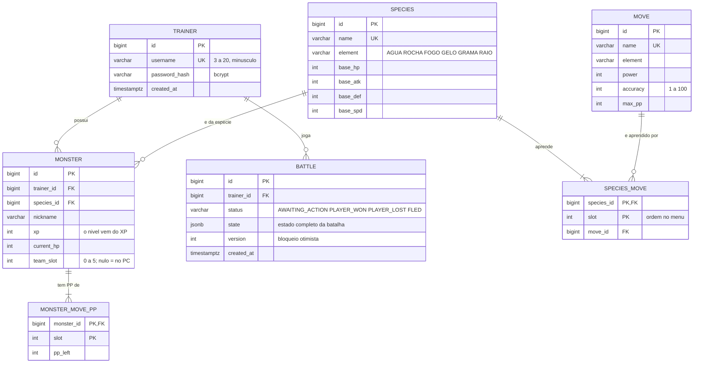

# Banco de dados

PostgreSQL, com o schema versionado pelo Flyway em
[`backend/src/main/resources/db/migration`](../backend/src/main/resources/db/migration):

- `V1__schema.sql`: tabelas, chaves e restrições.
- `V2__seed.sql`: os 6 clonemons e os 12 golpes do jogo original (ids 1 a 6 e 1 a 12).
- `V4__new_species.sql`: 6 clonemons novos, um por elemento (Boto, PaoDeAcucar, Pimentinha, Pinguim, Abacaxi e Gatonet, ids 7 a 12), com 2 golpes cada (ids 201 a 212).
  Os iniciais continuam sendo só os 6 originais; os novos aparecem como selvagens.

O Hibernate roda com `ddl-auto=validate`: ele só confere se as entidades batem com o schema, nunca o altera.

## Diagrama

## Decisões

| Decisão | Motivo |
|---|---|
| O nível não é uma coluna | É calculado a partir do XP (`ExperienceCurve`), então não tem como ficar inconsistente. |
| PP por golpe em `monster_move_pp` | Cada monstro gasta PP de forma independente; o `slot` liga o PP ao golpe da espécie. |
| `unique (trainer_id, team_slot)` adiável | Reorganizar o time troca slots dentro de uma transação. A verificação acontece só no commit. |
| Índice único parcial `battle_one_active_per_trainer` | Garante no banco no máximo uma batalha em andamento por treinador, mesmo com requisições simultâneas. |
| Estado da batalha em `jsonb` | O estado (os dois times, monstro ativo, log) é lido e gravado inteiro a cada turno; não é consultado por partes. |
| `version` na batalha | Dois turnos enviados ao mesmo tempo para a mesma batalha geram 409 em vez de corromper o estado. |
| Espécies em memória | `species`, `move` e `species_move` são dados fixos, carregados uma vez por `JpaSpeciesCatalog`. |

## Fluxo de um turno

1. A API carrega a batalha (`jsonb`) e reconstrói o domínio (`Battle.restore`).
2. O domínio resolve o turno e devolve os eventos.
3. HP, XP e PP dos monstros do jogador são gravados em `monster` e `monster_move_pp`, então o progresso fica salvo a cada turno.
4. Se o jogador vencer, o clonemon derrotado entra para o time (ou vai para o PC).
5. A batalha é gravada de volta, com checagem da `version`.
