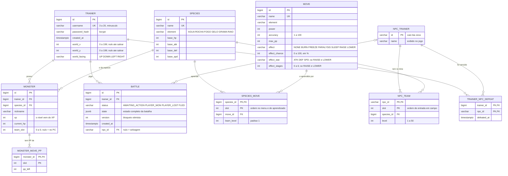

# Banco de dados

PostgreSQL, com o schema versionado pelo Flyway em
[`backend/src/main/resources/db/migration`](../backend/src/main/resources/db/migration):

- `V1__schema.sql`: tabelas, chaves e restrições.
- `V2__seed.sql`: os 6 clonemons e os 12 golpes do jogo original (ids 1 a 6 e 1 a 12).
- `V3__battle_content.sql`: efeitos secundários dos golpes, nível de aprendizado em `species_move`
  e 12 golpes novos (ids 101 a 112), dois por clonemon original, aprendidos nos níveis 7 e 12.
- `V4__new_species.sql`: 6 clonemons novos, um por elemento (Boto, PaoDeAcucar, Pimentinha, Pinguim, Abacaxi e Gatonet, ids 7 a 12), com 2 golpes cada (ids 201 a 212).
  Os iniciais continuam sendo só os 6 originais; os novos aparecem como selvagens.
- `V5__new_species_moves.sql`: os 6 clonemons do V4 ganham 2 golpes cada (ids 213 a 224), aprendidos nos níveis 7 e 12, como os originais.
- `V6__world.sql`: mapa do mundo. Posição do treinador (`world_x`, `world_y`, `world_facing` em `trainer`, nulas até a primeira gravação),
  os treinadores do mapa (`npc_trainer`, `npc_team`) com a seed de CAIO, BIA e ZECA, as vitórias sobre eles (`trainer_npc_defeat`)
  e `battle.npc_id` (nulo = batalha contra selvagem).

O Hibernate roda com `ddl-auto=validate`: ele só confere se as entidades batem com o schema, nunca o altera.

## Diagrama

## Decisões

| Decisão | Motivo |
|---|---|
| O nível não é uma coluna | É calculado a partir do XP (`ExperienceCurve`), então não tem como ficar inconsistente. |
| PP por golpe em `monster_move_pp` | Cada monstro gasta PP de forma independente; o `slot` liga o PP ao golpe da espécie. |
| `unique (trainer_id, team_slot)` adiável | Reorganizar o time troca slots dentro de uma transação. A verificação acontece só no commit. |
| Índice único parcial `battle_one_active_per_trainer` | Garante no banco no máximo uma batalha em andamento por treinador, mesmo com requisições simultâneas. |
| Estado da batalha em `jsonb` | O estado (os dois times, monstro ativo, log) é lido e gravado inteiro a cada turno; não é consultado por partes. |
| `version` na batalha | Dois turnos enviados ao mesmo tempo para a mesma batalha geram 409 em vez de corromper o estado. |
| Espécies em memória | `species`, `move` e `species_move` são dados fixos, carregados uma vez por `JpaSpeciesCatalog`. |
| Slots em ordem de aprendizado | Os golpes conhecidos num nível são sempre os primeiros slots, então `monster_move_pp` só cresce no fim quando o monstro aprende um golpe. Saves de antes da V3 têm menos linhas de PP: ao carregar, os golpes que faltam vêm com PP cheio. |
| Efeito do golpe em colunas com padrão | `effect = 'NONE'` e `learn_level = 1` por padrão, então inserts que não citam as colunas novas continuam válidos. A restrição `move_effect_consistency` impede combinações sem sentido (status com atributo, RAISE sem estágios...). |
| Status e estágios só no `jsonb` | Valem apenas durante a batalha: ficam no `state` (`status`, `sleepTurns`, `stages` de cada monstro) e somem quando ela termina. Batalhas salvas sem esses campos carregam sem status e com estágios zerados. |
| Posição do mapa em colunas de `trainer` | É uma por treinador e sempre lida inteira. A restrição `trainer_world_position_complete` garante que as três colunas são nulas juntas (ainda sem posição) ou preenchidas juntas. |
| NPCs em tabelas, carregados em memória | Como as espécies, `npc_trainer` e `npc_team` são dados fixos, lidos uma vez por `JpaNpcCatalog`. Cada desafio cria o time do NPC do zero, com HP e PP cheios. |
| `battle.npc_id` em coluna, fora do `jsonb` | Diz de quem é a batalha (e, portanto, a IA e o nome nos eventos) com chave estrangeira. O `state` não mudou: batalhas antigas têm `npc_id` nulo e carregam como selvagens. |
| Vitória em `trainer_npc_defeat` | A chave `(trainer_id, npc_id)` impede registrar a mesma vitória duas vezes; o insert usa `on conflict do nothing`. A lista de derrotados sai em ordem de `defeated_at`. |

## Fluxo de um turno

1. A API carrega a batalha (`jsonb`) e reconstrói o domínio (`Battle.restore`); com `npc_id`, a batalha é contra aquele treinador.
2. O domínio resolve o turno e devolve os eventos.
3. HP, XP e PP dos monstros do jogador são gravados em `monster` e `monster_move_pp`, então o progresso fica salvo a cada turno.
4. Se o jogador vencer um selvagem, o clonemon derrotado entra para o time (ou vai para o PC). Se vencer um treinador, a vitória vai para `trainer_npc_defeat` e ninguém é recrutado.
5. A batalha é gravada de volta, com checagem da `version`.
